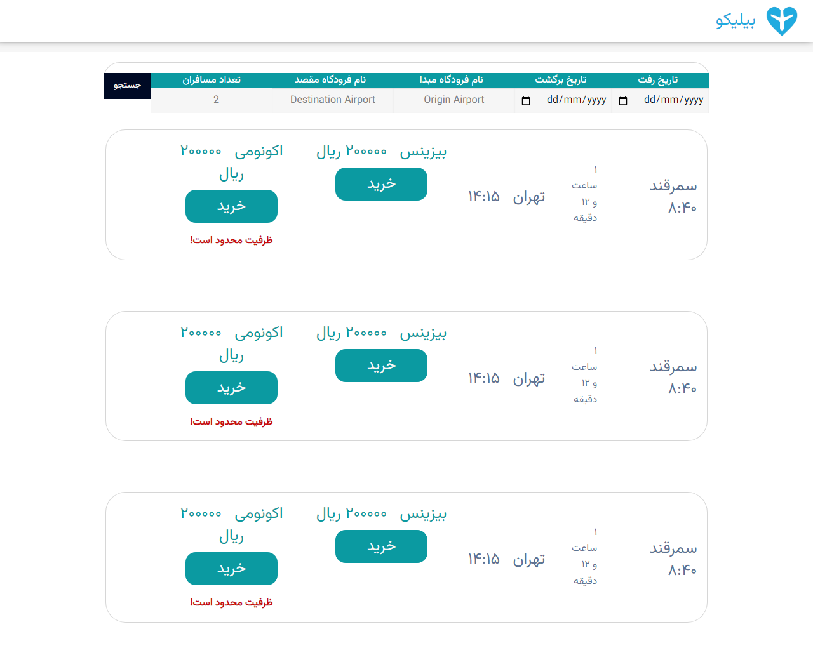
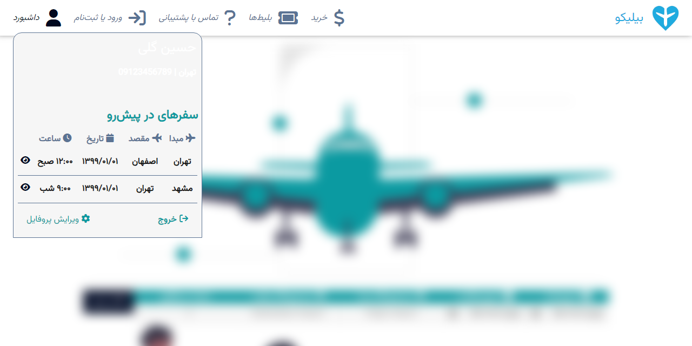
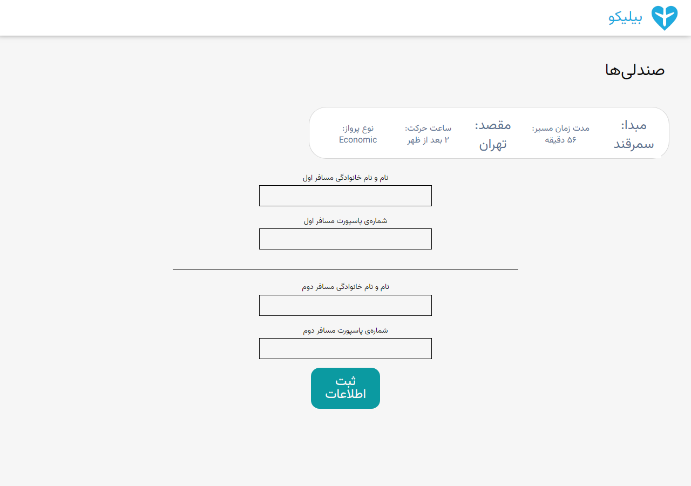
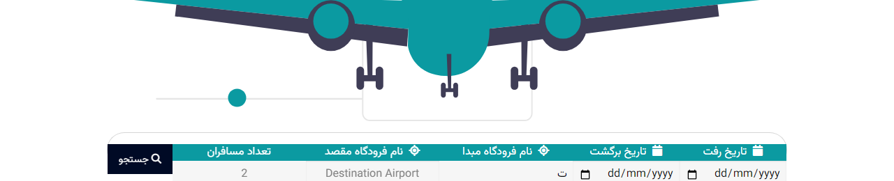
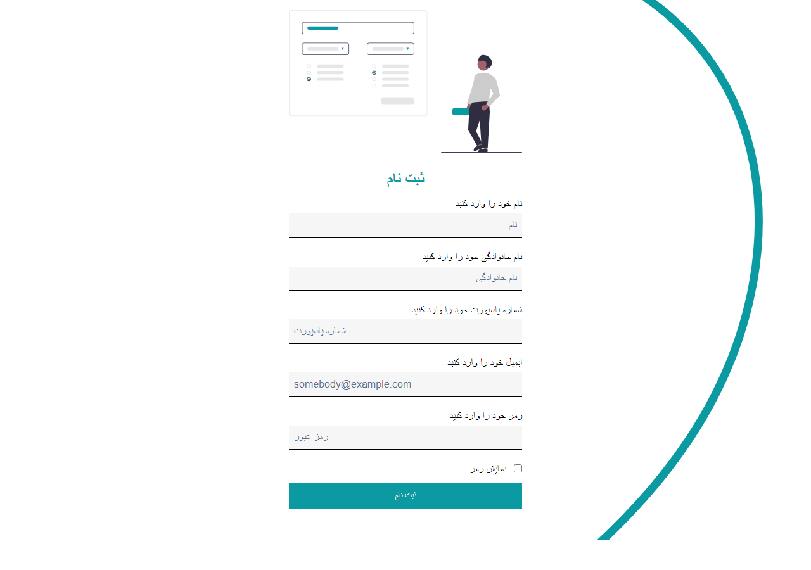

# Biliko

**A right-to-left flight booking interface in Persian, built as a static site on Foundation 6.**

Biliko (بیلیکو) is a five-page front end for a domestic flight booking service: search for a route, browse fares by cabin class, enter passenger details, sign in, sign up. There is no backend. Flights, prices and the account panel are fixture data, which is deliberate; this repository is about the interface and the styling layer underneath it.

I built it with [Arash Yadegari](https://github.com/Arash1381-y) and [Hasti Karimi](https://github.com/HastiKarimi).

## The problem it addresses

Most CSS framework examples assume a left-to-right page, and most right-to-left demos stop at adding `dir="rtl"` to `<html>`. A real Persian interface needs more than that:

- The top bar, grid and dropdown positioning all have to mirror, while the framework's own components keep working.
- Direction is per field, not per page. A passport number or an email address stays left-to-right inside a form whose labels run right-to-left.
- The font stack has to carry Persian, and Persian digits (۸:۴۰, ۲۰۰۰۰۰) need to sit next to Latin ones without the line falling apart.
- Validation messages, placeholders and error toasts have to read naturally in Persian, including the toast library's own stylesheet.

Biliko is a worked example of all of that on Foundation Sites 6.7, with a thin custom SCSS layer on top rather than a fork of the framework.

## Screenshots

| Home page | Search results |
|:--|:--|
|  |  |

| Account dropdown over a blurred page | Passenger details |
|:--|:--|
|  |  |

## What each page does

| Page | What it is |
|:--|:--|
| `index.html` | Landing page: mirrored top bar, hero with the trip search bar, three marketing sections on Foundation's XY grid, site footer. Hosts the account dropdown and the mobile drawer. |
| `tickets.html` | Search results. The same search bar, then fare cards showing origin and destination with times, flight duration, and separate business and economy prices with a buy button each. A low-capacity warning renders in red. |
| `buy.html` | Passenger details for a selected flight. Summary strip for the chosen leg (origin, destination, duration, departure time, cabin), then name and passport fields for two passengers. |
| `logIn.html` | Email and password sign-in on an SVG blob background. |
| `signUp.html` | Registration with name, surname, passport number, email and password, wired to client-side validation with Persian error toasts. |
| `navbar.html` | A standalone page containing only the navigation bar and account dropdown. I kept it as an isolated scratch page for working on the nav without loading the whole home page. |

## The design layer

The interesting part of this repository is `scss/`, not the HTML. Foundation supplies the grid, top bar, dropdown and off-canvas primitives; everything below is mine.

### Utility classes generated from SCSS maps

Rather than writing one class per colour and one per heading size, `scss/_colors.scss` and `scss/components/_typography.scss` iterate over maps and emit the whole set. The theme is defined once in `scss/_settings.scss`:

```scss
$text-primary:   #0B9AA1;
$text-secondary: #5B7393;

$my-palette: (
  "primary":   $text-primary,
  "secondary": $text-secondary,
);
```

and `_colors.scss` turns each entry into a text colour, a bold text colour, a background container with darkened hover, focus and active states, and a hover-only text colour:

```scss
@each $key, $val in $my-palette {
  .container-#{$key} {
    background-color: $val;
    &:hover, &:active, &:focus { background-color: darken($val, 10%); }
  }
  .text-#{$key}      { color: $val; }
  .text-#{$key}-bold { color: $val; font-weight: bold; }
}
```

`_typography.scss` does the same across two dimensions, crossing Foundation's `$heading-font-sizes` map with nine font weights to produce `.typography-h1-100` through `.typography-h6-900`. That is where markup like `class="typography-h4-600 text-primary"` in the pages comes from. Adding a colour to the palette map gives you four new classes; adding a heading size gives you nine.

### Right-to-left navigation with a mobile drawer

`scss/components/_navbar.scss` keeps the desktop icon menu and the hamburger button mutually exclusive through Foundation breakpoint mixins:

```scss
.topbar-menu-icon  { display: none; @include breakpoint(medium)     { display: block; } }
.topbar-breadcrumb { display: none; @include breakpoint(small only) { display: block; } }
```

`scripts/mobileAppBar.js` toggles `.is-hidden` on `#menu-mobile`, and the drawer animation is switchable at build time through a single variable (`$topbar-responsive-animation-type`, one of `fade-in`, `slide-down` or `none`) that selects between two keyframe sets with an `@if` chain.

### Account dropdown with a blurred backdrop

The dashboard panel uses Foundation's `dropdown-container` mixin but is repositioned and restyled: pinned below the bar on desktop at a fixed 350px, expanded to a full-width sheet anchored to the top on small screens. Opening it also calls `blurMainPageContent()` from `scripts/overlayEffect.js`, which toggles a `.darker` class carrying `filter: blur(10px)` on `#main-page-content`, so the page behind the panel goes soft while the panel stays sharp. The panel itself shows the signed-in traveller, their upcoming trips as a small grid, and sign-out and edit-profile actions.

### Airport autocomplete

`forms.js` is a dependency-free typeahead bound to both airport fields. It matches on prefix, bolds the matched prefix in each suggestion, supports arrow-key navigation with a wrapping focus index, commits on Enter or click, and closes open lists on any outside click. The source list is the 31 provinces of Iran, in Persian.

Typing `ت` in the origin field narrows the list to `تهران`; pressing the down arrow highlights it and Enter writes it into the input.



### Per-field direction and Persian validation

`scss/components/_form.scss` defines `.fa-input` (right-to-left, right-aligned) and `.en-input` (left-to-right, left-aligned) so that Persian names and Latin passport numbers or emails each sit the right way round inside one right-to-left form. Foundation's default input chrome is stripped down to a single bottom border that picks up the brand colour on focus.

Native constraint messages are replaced with Persian text through paired `oninvalid` and `oninput` handlers calling `setCustomValidity`, and `scripts/signUpValidation.js` adds length rules on top, surfacing them through AlertifyJS with its right-to-left stylesheet loaded. The branch for a password shorter than six characters reads:

```js
errorMessages = 'رمز عبور باید حداقل 6 کاراکتر باشد';
window.alertify.error(errorMessages);
return false;
```

The registration page is where both directions sit in one form: Persian labels and names running right to left, the passport number and the email address left to right.



## Built with

| Layer | What I used |
|:--|:--|
| Framework | Foundation Sites 6.7.5 (XY grid, top bar, dropdown, off-canvas, forms), Motion UI |
| Styling | SCSS, compiled to a single `css/app.css`; Autoprefixer through PostCSS |
| Typography | Vazirmatn from Google Fonts, with a Helvetica and Arial fallback chain |
| Icons | Font Awesome 6.2.1 from a CDN |
| Scripting | Plain JavaScript, plus jQuery and what-input as Foundation's own requirements |
| Feedback | AlertifyJS 1.13 with its RTL theme |
| Dates | Moment.js, used to read the ISO 8601 durations in the fixture data |
| Build | Gulp 4 with BrowserSync for live reload |

## Running it

The pages load jQuery, Foundation, AlertifyJS and Moment from `node_modules/` by relative path, so opening `index.html` straight from a fresh clone gives you the styling but none of the scripts. Install dependencies first.

### Quick look

```bash
git clone https://github.com/Imanm02/Biliko-Flight-Booking-UI.git
cd Biliko-Flight-Booking-UI
yarn install --ignore-scripts
npx serve .
```

`package.json` declares `foundation-sites` and `motion-ui` as `latest`; `yarn.lock` is what pins them, to 6.7.5 and 2.0.3. Install with yarn rather than npm, or you will get whatever Foundation released most recently.

`--ignore-scripts` matters. The build chain pulls in node-sass 4.14, which has no prebuilt binary for current Node releases and falls back to a node-gyp build that fails; skipping install scripts sidesteps it. You do not need node-sass to view the site, because `css/app.css` is committed.

Any static server works in place of `npx serve`, for example `python -m http.server`. Serving over HTTP rather than opening the file directly is required for the module script on the results page.

### Rebuilding the stylesheet

`css/app.css` is generated from `scss/app.scss`. To rebuild it without the legacy Gulp toolchain, compile with dart-sass and point it at Foundation's and Motion UI's source directories:

```bash
npx sass@1.83.4 \
  --load-path=node_modules/foundation-sites/scss \
  --load-path=node_modules/motion-ui/src \
  --style=compressed --no-source-map \
  scss/app.scss css/app.css
```

Foundation 6.7.5 calls `color.channel()` internally, so an older dart-sass will not do; 1.77 fails with an undefined-function error and 1.83 compiles cleanly.

### The original Gulp pipeline

`gulpfile.js` is the Foundation starter pipeline: compile `scss/app.scss` with the same two include paths, run Autoprefixer, write to `css/`, serve the project root through BrowserSync, and reload on SCSS or HTML changes.

```bash
yarn start   # gulp: build the CSS, serve, watch
yarn build   # gulp sass: build the CSS only
```

Both scripts expect the yarn-installed dependency tree from the quickstart above.

This needs the old toolchain to install, which means Node 14 or earlier for node-sass 4.14. Swapping `gulp-sass@4` for `gulp-sass@5` backed by `sass` makes it work on modern Node; I verified the SCSS itself compiles under dart-sass unchanged.

## Project structure

```
index.html            landing page, search bar, marketing sections, footer
tickets.html          search results with fare cards
buy.html              passenger details for a selected flight
logIn.html            sign-in form
signUp.html           registration form
navbar.html           isolated scratch page for the nav and account dropdown

scss/
  app.scss            entry point: Foundation includes, then the custom layer
  _settings.scss      Foundation settings, overridden with the Biliko theme
  _colors.scss        palette map to utility classes
  _utility.scss       spacing helpers, the blur class, body layout mixins
  components/         navbar, dashboard, footer, form, hero, button, grid, type

css/app.css           compiled stylesheet, committed so the site runs unbuilt

forms.js              airport typeahead
app.js                Foundation initialiser
scripts/
  mobileAppBar.js     mobile drawer toggle
  overlayEffect.js    blur the page behind the account panel
  signUpValidation.js registration rules and Persian error toasts
  load-ticket.js      renders fare cards from tickets.json

tickets.json          fixture flights
assets/images/        SVG illustrations, logo, background blobs
docs/screenshots/     the screenshots used above
```

## The fixture data

`tickets.json` holds the flight records the results page is meant to render. Durations are ISO 8601, which is why Moment is in the stack:

```json
{
  "source_airport": "تهران",
  "dest_airport": "سمرقند",
  "start_time": "8:30",
  "end_time": "9:42",
  "duration": "PT1H12M",
  "economy":  { "price": "2000",  "left_tickets": "9"  },
  "business": { "price": "5000",  "left_tickets": "60" }
}
```

`left_tickets` is what drives the low-capacity warning on a fare card, and a value of `0` is what a sold-out cabin looks like.

## Known gaps

I would rather list these than let someone discover them by running the project.

- **No backend.** Search, sign-in, registration and purchase submit nowhere. The fare cards on `tickets.html` are hand-written HTML, not rendered from `tickets.json`.
- **`scripts/load-ticket.js` does not run.** It uses the old `import ... assert { type: 'json' }` syntax, which current browsers reject in favour of `with`, and its render loop appends to `tbl` and `tblBody` variables that were never declared.
- **`css/component.css` does not exist.** Three pages link to it and get a 404. Nothing in the build produces it.
- **The committed `css/app.css` is older than `scss/`.** It predates the `prefers-color-scheme` blocks in `_utility.scss`, and the one block `index.html` actually uses, `.flex-body-column-direction`, has its light and dark cases inverted, so rebuilding the stylesheet as-is turns the home page background black in light mode. The other two pairs in that file are correct. The colour-scheme support should be treated as unfinished.
- **`assets/images/Hexagon.svg` is missing**, so the account panel header loses its dark background and its white text is hard to read.
- **Narrow viewports scroll sideways.** The hamburger and the drawer work, but `.search-section` is a flex row that never wraps, so the search bar overflows on a phone.
- **Leftovers.** `value="<?php echo date('Y-m-d'); ?>"` sits in the date inputs on two pages even though nothing here runs PHP, the "show password" checkbox has no handler behind it, and `logIn.html` and `signUp.html` are missing the Vazirmatn `@import` the other pages carry, so they fall back to a Latin font. The `gulpfile.js` build pipeline is still the Foundation starter's, and `css/app.css` is committed build output rather than generated at install time.

## Background

This started in late 2022 as a three-person team project and stayed a front-end-only exercise by design. The same product was later rebuilt as a full-stack application, with a Go service behind a React client, in [a separate repository](https://github.com/Imanm02/Flight-Booking-Microservices). The starting point for the build setup was Foundation's own [foundation-sites-template](https://github.com/foundation/foundation-sites-template), which is why its history appears in this repository's commit log.

## License

MIT. See [LICENSE](LICENSE).
